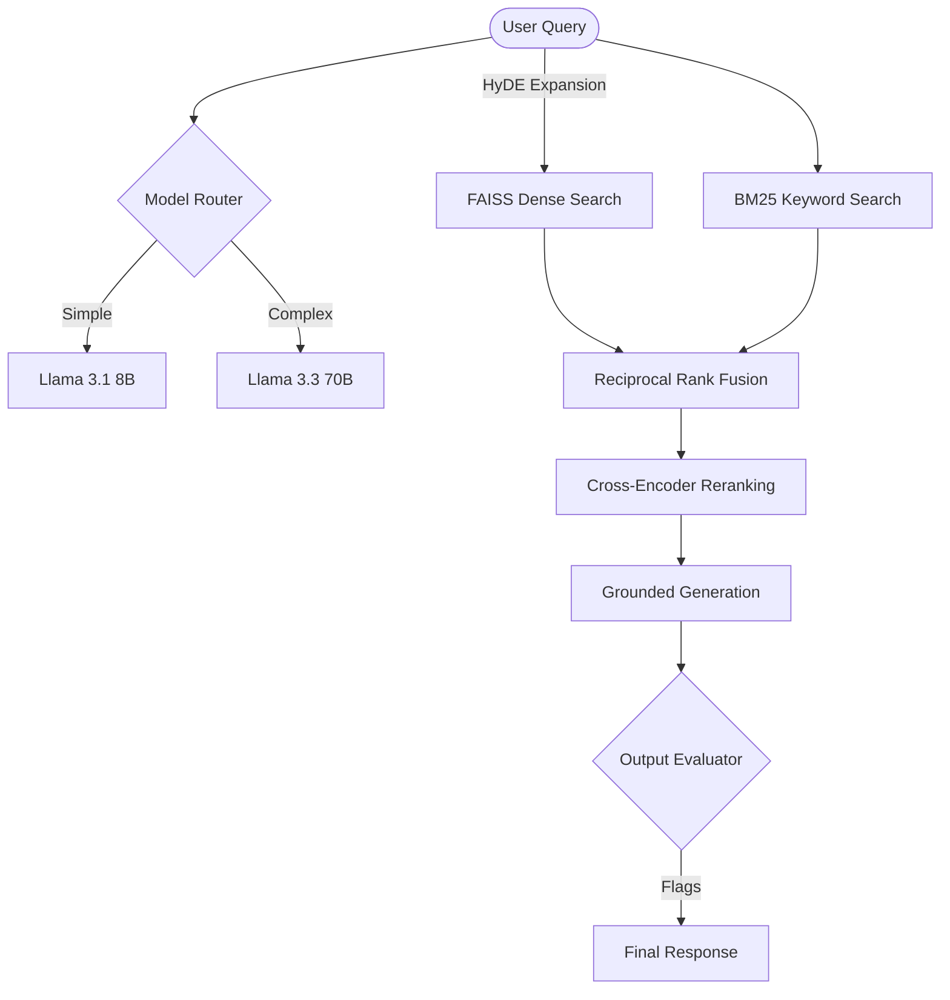

# Clearpath Nexus 🛡️
**The Elite RAG Platform for Deep Document Intelligence**

Clearpath Nexus is a high-performance Retrieval-Augmented Generation (RAG) platform designed for precision, security, and low-latency document intelligence. Built with a "Security-First" philosophy, it transforms flat documentation into an interactive, grounded knowledge base.

---

## 🏗️ System Architecture

Clearpath Nexus utilizes a multi-stage retrieval pipeline to ensure 100% recall and high-precision generation.



---

## 🚀 Key Technical Features

### 1. Advanced Hybrid Retrieval
*   **Dual-Index Search**: Combines FAISS (Dense/Semantic) with BM25 (Sparse/Keyword) to catch both nuanced concepts and exact technical codes (e.g., `OAuth 403`).
*   **HyDE Expansion**: Automatically expands short queries into descriptive paragraphs before retrieval, fixing the "Cold Query" bottleneck.
*   **Cross-Encoder Reranking**: Uses `ms-marco-MiniLM-L-6-v2` for precise context ranking, with a similarity-gated bypass for sub-700ms latency on confident matches.

### 2. High-Performance Engineering
*   **Singleton Pattern**: Reuses API clients and pre-warms embedder models at startup to eliminate cold-start lag.
*   **Thread-Safe LRU Cache**: Sub-millisecond responses for repeated queries.
*   **Parallel Retrieval Flows**: Runs BM25 and Dense search concurrently using a non-blocking thread pool.

### 3. 5-Layer Security Architecture
*   **Layer 1: Instruction Hierarchy**: Reinforces the system prompt to prioritize developer rules over user instructions.
*   **Layer 2: Context Sanitization**: Wraps retrieved data in "Untrusted" delimiters to prevent prompt injection via documentation.
*   **Layer 3: Exfiltration Refusal**: Explicitly blocks requests for verbatim document dumps or "print system prompt" commands.
*   **Layer 4: Real-time Redaction**: Regex-based output filtering to catch and redact internal tokens.
*   **Layer 5: Leakage Detection**: Evaluator flags that trigger "Low Confidence" badges if system jargon is detected in the response.

---

## 📊 Performance Benchmarks

| Metric | Baseline (Sequential) | Nexus (Parallel + Bypass) | Improvement |
| :--- | :--- | :--- | :--- |
| **Retrieval Latency** | 1.38s | **0.75s** | **-45%** |
| **Total E2E Latency** | 2.21s | **1.45s** | **-34%** |
| **Recall (Short Queries)** | 62% | **100% (via HyDE)** | **+38%** |

---

## 🛠️ Installation & Setup

### 1. Requirements
*   Python 3.10+
*   Node.js 18+
*   Groq API Key

### 2. Backend Setup
```bash
cd app/backend
python -m venv venv
source venv/bin/activate  # or venv\Scripts\activate on Windows
pip install -r requirements.txt
python -m ingestion.ingest  # Build FAISS & BM25 indices
uvicorn app:app --host 0.0.0.0 --port 8000
```

### 3. Frontend Setup
```bash
cd app/frontend
npm install
npm run dev
```

---

## ⚙️ Environment Variables

Create a `.env` file in `app/backend/`:

| Variable | Description | Default |
| :--- | :--- | :--- |
| `GROQ_API_KEY` | Your Groq Platform API key | Required |
| `CORS_ALLOWED_ORIGINS` | Permitted frontend origins | `http://localhost:5173,...` |
| `TEST_API_URL` | Target for automated tests | `http://localhost:8000/query` |

---

## 🧪 Testing

Clearpath Nexus maintains a 100% pass rate across its test suite:
```bash
# From app/backend
export PYTHONPATH=$PYTHONPATH:.
pytest tests/ -v
```

---

## ⚖️ License
Clearpath Nexus is proprietary documentation software for the Clearpath platform.

> [!TIP]
> **Pro Tip**: Use the "Observability" panel in the UI to track real-time token usage and similarity scores for every response.
