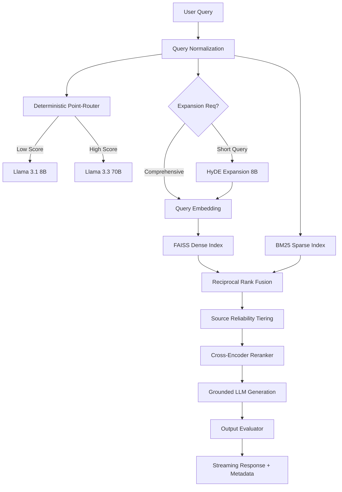

# Clearpath Nexus 🛡️

**A Hybrid RAG System for Grounded Document Intelligence**

Clearpath Nexus is a high-precision Retrieval-Augmented Generation (RAG) system built to handle noisy, heterogeneous document corpora (PDFs) with a focus on **grounding, security, and observability**. 

It was developed as a "defense-in-depth" architecture, moving away from simple vector-search and towards a multi-stage pipeline that balances semantic understanding with hard lexical constraints.

---

# 🏗️ System Architecture

Clearpath Nexus leverages a layered retrieval and validation pipeline.



---
```We didn't used any vector DB because if we would have used that this assignment would be more or less just a wrapper around that so we adhere to the guidelines as per the assignment of not using any third party libraries and all```

# 🚀 Key Features & Innovations

### 1. Hybrid Retrieval with RRF
We combine **Dense Retrieval** (FAISS) for semantic "vibes" with **Sparse Retrieval** (BM25) for literal keyword matches (e.g., error codes like "403" or versions like "v2.1"). Results are merged using **Reciprocal Rank Fusion (RRF)**.

### 2. Source Reliability Tiering (Metadata Boosting)
To solve the problem of "official vs. casual" document conflicts, I implemented a **Tiering System**. Documents with technical prefixes (e.g., `Pricing/`, `Technical/`) receive a calculated boost in the final ranking, ensuring the system trusts source-of-truth manuals over internal sale retrospectives.

### 3. Asynchronous Streaming with Hidden Metadata
We support **real-time token streaming**. Since streaming typically breaks structured metadata (token counts, scores), I implemented an **Envelope Pattern**: once the stream finishes, a hidden JSON payload is appended. The frontend parses this to populate the **Observability Panel** while the user sees only the text response.

### 4. Deterministic Point-Router
Instead of using an expensive LLM to route queries, we use a **heuristic scoring engine** based on grammatical markers, length, and technical intent keywords. This ensures <10ms routing latency.

---

# 📚 Chunking Strategy - Tradeoffs & Rationale

### The Challenge
The corpus consists of 30 heterogeneous PDFs with inconsistent heading formats, complex tables, and occasional malformed text. A naive section-aware chunker would likely fail on these structural inconsistencies, leading to "silent extraction loss."

### Final Strategy: Sliding Window (900 chars / 180 overlap)
We intentionally chose a fixed-length sliding window to ensure **100% coverage reliability**.
*   **900 character chunks**: Small enough to isolate specific facts, but large enough to preserve intra-paragraph reasoning.
*   **180 character overlap**: Prevents "boundary loss" where a critical fact (like an SLA percentage) is split between two chunks, making it unretrievable.

### Tradeoffs
| Decision | Benefit | Cost |
| --- | --- | --- |
| Sliding Window | Guaranteed full coverage of unstructured docs | No native semantic boundary awareness |
| Smaller Chunks | Higher vector specificity | Increased indexing overhead |
| Overlap | Prevents information loss at boundaries | Minor duplication in context window |

---

# � Retrieval Engine - Hybrid + Reranked

### Why Hybrid?
*   **Dense (FAISS)**: Captures semantic "vibes" but often misses exact tokens like "403" or "v2.1".
*   **Sparse (BM25)**: Captures lexical identity (exact matches) but fails on paraphrased queries.

Clearpath Nexus combines both using **Reciprocal Rank Fusion (RRF)**.

### The 7-Stage Retrieval Pipeline
1.  **HyDE Expansion**: Underspecified queries ( < 8 words) are expanded into hypothetical answers to align with document embeddings.
2.  **Dense Retrieval**: Normalized Inner Product search over FAISS vectors.
3.  **Sparse Retrieval**: Lexical search using the `rank-bm25` algorithm.
4.  **RRF Fusion**: Merges both lists into a unified ranking.
5.  **Source Reliability Tiering**: Applies a weight boost to authoritative prefixes (Pricing, Technical).
6.  **Cross-Encoder Reranking**: Joint evaluation of `(query, chunk)` for top-6 candidates.
7.  **Dynamic Thresholding**: Filters out "background noise" using a `mean - std_dev` similarity gate.

---

# 🛡️ Security Architecture - 5-Layer Defense

Documentation is treated as untrusted data. We implement a defense-in-depth model:
1.  **Instruction Hierarchy**: System prompts are explicitly prioritized over document strings.
2.  **Instruction Wrapping**: All context chunks are wrapped in markers that clearly separate "Data" from "Command."
3.  **Refusal Rules**: Explicit rules prevent the LLM from "dumping" documents or leaking internal file paths.
4.  **Leakage Detection**: The evaluator scans for mentions of internal paths or system metadata in the final answer.
5.  **PII/Sensitive Filtering**: Regex-based output redaction for potential key leakage.

---

# 📊 Performance Engineering

### Optimizations
*   **Warm Connection Pools**: `AsyncGroq` client is pre-warmed during lifespan startup.
*   **Singleton Pattern**: Embedding models and FAISS indices are loaded once into memory.
*   **Parallel Retrieval**: Dense and Sparse retrievals run concurrently using Python's `asyncio` or `futures`.
*   **LRU Cache**: A thread-safe cache handles repeat queries in **~2ms**.

---

# 🤖 Models & Environment

### Models Used
- **Primary LLM**: `llama-3.3-70b-versatile` (Complex Reasoning)
- **Secondary LLM**: `llama-3.1-8b-instant` (Fact Checking / Scaling)
- **Local Embedding**: `sentence-transformers/all-MiniLM-L6-v2`
- **Local Reranker**: `cross-encoder/ms-marco-MiniLM-L-6-v2`

### Environment Config
Create a `.env` file in `app/backend/` with:
```env
GROQ_API_KEY=your_api_key_here
```

---

# 🏆 Bonus Challenges Attempted

1.  **Conversation Memory**: Stateless, frontend-managed window (last 6 messages).
2.  **Streaming Responses**: Fully asynchronous token-by-token streaming with "hidden envelope" metadata parsing for real-time observability.

---
# Demo Images:


# 🛠️ Setup & Execution

### 1. Prerequisites
- Python 3.10+
- Node.js & npm
- Groq API Key

### 2. Backend
```bash
cd app/backend
python -m venv venv
# Windows: venv\Scripts\activate
pip install -r requirements.txt
python -m ingestion.ingest  # Builds indices
uvicorn app:app --port 8000
```

### 3. Frontend
```bash
cd app/frontend
npm install
npm run dev
```

---

# 🧪 Research & Reflection

### Known Issues & Limitations
1.  **CPU Reranking**: Runs synchronously on CPU, blocking the FastAPI event loop under high concurrency.
2.  **Static Router**: Heuristic-based; cannot learn from query shifts without re-engineering scoring points.
3.  **Chunk Size Staticity**: Fixed at 900 chars; very large tables might still suffer from fragmentation.

---
